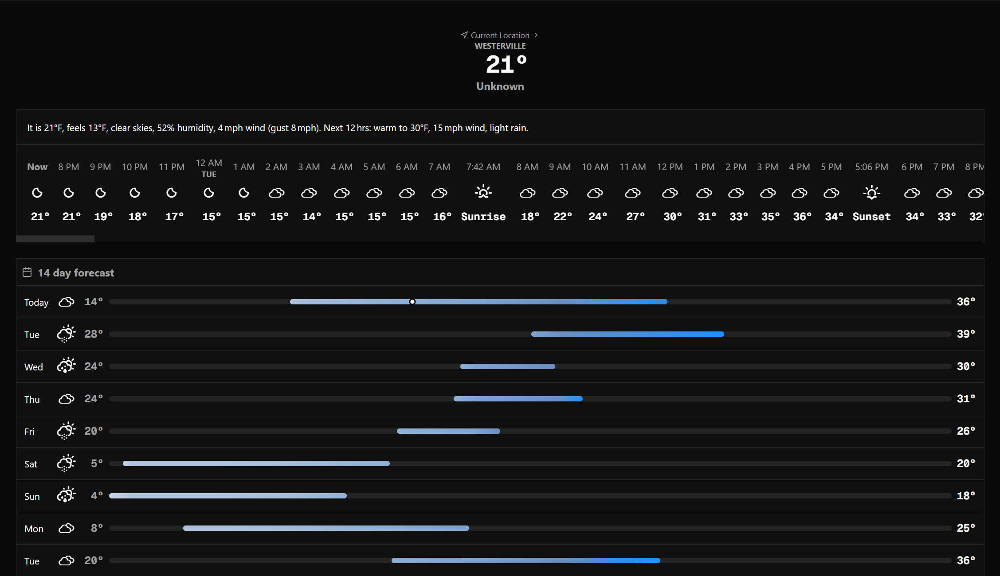

# Hiems

## About

Hiems is a mobile first weather site. >95% of the development was done using chrome devtools to simulate a mobile device. It _works_ on desktop, but it's primarily for mobile users. It's design was inspired by apple weather.



## Running locally

Clone this, run `npm install`, `npm run dev`, go to [http://localhost:3000](http://localhost:3000), you know the drill, it's a next.js app.

## [OPTIONAL] AI creds

You can optionally populate the `.env` file as follows if you want the AI powered summary. You can use any OpenAI compliant provider, but the hosted version uses [Hack Club AI](https://ai.hackclub.com/), a free AI provider.

> [!IMPORTANT]
> Hack Club AI is only for verified high schoolers, sorry!

```
AI_API_KEY=[do you really think i'm going to put this in a readme]
AI_API_BASE_URL=https://ai.hackclub.com/proxy/v1
AI_MODEL=openai/gpt-oss-120b
NEXT_PUBLIC_USE_AI=true
```
