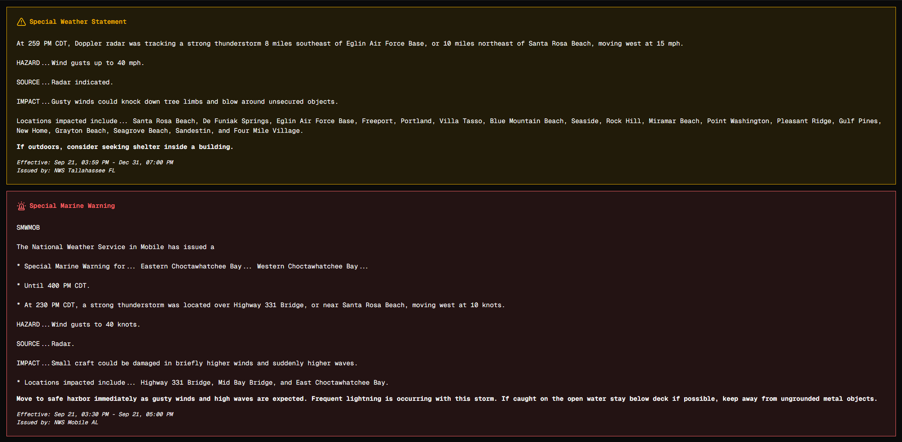

# tempestas

A opensource, adfree, and free weather (web)app. It gets most of it's data from [open-meteo](https://open-meteo.com/), and gets weather alerts (in the US only rn, sorry) from the [NWS](https://www.weather.gov/documentation/services-web-api#/). It's built using [Next.JS](https://nextjs.org/) and uses a modified version of [shadcn](https://ui.shadcn.com/). The chart is made using [recharts](https://recharts.org/). It's all on a single page, mainly cuz there isn't a reason to split it up. i'm now kinda regretting this cuz the file is 2k lines :sob:

### Location

tempestas uses a basic lat-long input system, but it can also get your current location using browser APIs, take a US zip code, or use one of the pre selected options. It can also use a geocoding API to turn a place name (ie. "Shelburne, VT") into coords. The default favorites are Hack Club HQ (also the default overall), Null Island (0,0, where google maps photos go if they don't have a location), Hell, Michigan (real place), and Alcatraz (idk i wanted four and i didn't have any better ideas), but they can be edited!

### Alerts

tempestas can get alerts from the NWS, and since most people won't see one (unless you're doing siege voting during a tornado or something (please don't)), I thought I'd include a couple screenshots. Severe and Extreme alerts are made with a red background, and all the rest are made with a yellow background. When I was writing this I though I'd take two screenshots, one with the red warning and one with the yellow one, but I found somewhere with both! (i had to zoom way out to get them both, but it shows what happens when there's two alerts!)

### Geocoding

You search for places (and thus coords). It's powered by the [ArcGIS Geocoding API](https://geocode.arcgis.com/), and is pretty fast.

### Running locally

Clone, run `npm install`, and `npm run dev`. It should just work™, but if it doesn't feel free to contact me on the [hackclub slack](https://hackclub.slack.com/team/U078RA454JH) (if you're a teenager) or make a github issue!

### License

This software is licensed under the [GNU GPLv3](LICENSE.md). This means you can use this for free as long as you provide attribution, distribute under a compatible license, and don't use DRM. You can also use this without attribution as long as it's for personal use! Please note that this is a summary, not a legally binding license, and you _must_ follow the full GNU GPLv3 license terms.
