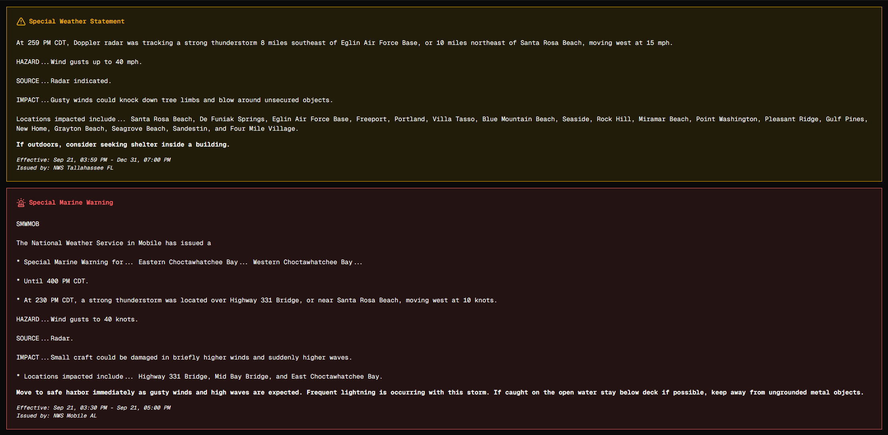

# Tempestas

## About

Tempestas is a mobile first weather site. >95% of the development was done using chrome devtools to simulate a mobile device, and I also used a actual phone to validate that everything worked well. It _works_ on desktop, but it's primarily for mobile users. It's design was inspired by apple weather. It has hourly and daily forecasts, as well as a summary of the next 10 hours.

<details>

<summary>New in V0.2</summary>

### Detail view for all widgets

Every single widget has a detail view. Most of them have a graph showing the value over 24 hours.

##### Responsive display

The details view is displayed in a drawer on mobild and in a dialog on desktop. (to be more specific it uses a drawer when the pointing device is "rough" and uses a dialog otherwise.)

### Elevation Calculation

The site queries the Open Meteo elevation API before fetching the weather, this makes the forecast more accurate.

### Visibility widget

There's a visibility widget, not sure what eles to say here.

</details>


## People from siege!

If you can, try this on your phone, it works better! If you can't you can use dev tools to simulate one!



## Running locally

Clone this, run `npm install`, `npm run dev`, go to [http://localhost:3000](http://localhost:3000), you know the drill, it's a next.js app.

#### [OPTIONAL] AI creds

You can optionally populate the `.env` file as follows if you want the AI powered summary (if you don't just leave it blank). You can use any OpenAI compliant provider, but the hosted version uses [Hack Club AI](https://ai.hackclub.com/), a free AI provider.

> [!IMPORTANT]
> Hack Club AI is only for verified high schoolers, sorry!

```
AI_API_KEY=[do you really think i'm going to put this in a readme]
AI_API_BASE_URL=https://ai.hackclub.com/proxy/v1
AI_MODEL=openai/gpt-oss-120b
NEXT_PUBLIC_USE_AI=true
```
